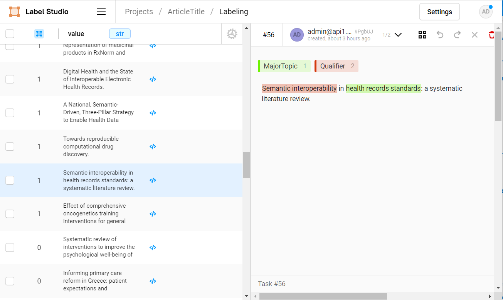
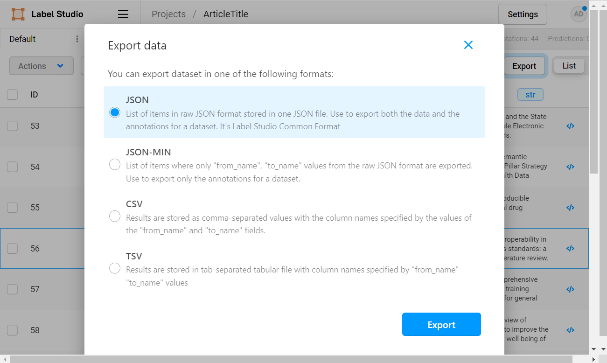
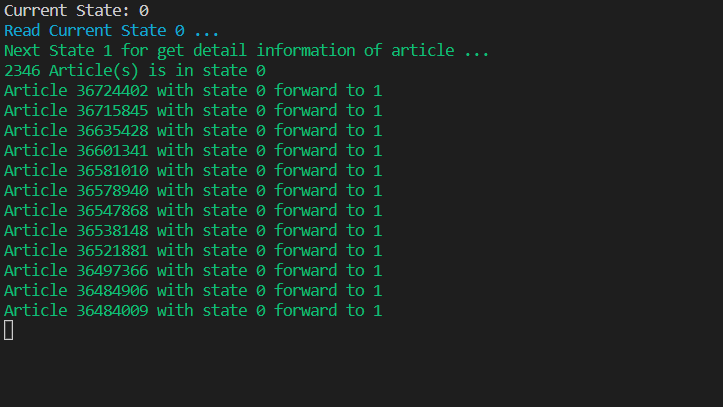

# triple-a
Article Analysis Assistant

# Use 

## Setup

```
python -m venv venv
```

```
.\venv\Scripts\activate
```


```
pip install poetry
```

```
poetry install
```

```
poetry run python triplea/cli/main.py 
```


## Functional Use

get list of PMID in state 0
```
term = '("Electronic Health Records"[Mesh]) AND ("National"[Title/Abstract]) AND Iran'
get_article_list_all_store_to_kg_rep(term)
```

move from state 1
```
move_state_forward(1)
```

get list of PMID in state 0 and save to file for debugginf use
```
    data = get_article_list_from_pubmed(1, 10,'("Electronic Health Records"[Mesh]) AND ("National"[Title/Abstract])')
    data = get_article_list_from_pubmed(1, 10,'"Electronic Health Records"')
    data1= json.dumps(data, indent=4)
    with open("sample1.json", "w") as outfile:
        outfile.write(data1)
```

open befor file for debuging use
```
    f = open('sample1.json')
    data = json.load(f)
    f.close()
```

get one article from kg and save to file
```
    data = get_article_by_pmid('32434767')
    data= json.dumps(data, indent=4)
    with open("one-article.json", "w") as outfile:
        outfile.write(data)
```

Save Title for Annotation
```
    file =  open("article-title.txt", "w", encoding="utf-8")
    la = get_article_by_state(2)
    for a in la:
        try:
            article = Article(**a.copy())
        except:
            pass
        file.write(article.Title  + "\n")
```

### Trainong NER for Article Title
**Step 1:** Annotate train data with Label Studio



**Step 2:** Export json from Label Studio



**Step 3:** Convert Label Studio Json format to Spacy Training data
```
file = r"C:\...\project-4-at-2023-02-10-10-20-6a18f1dc.json"
data = convert_label_studio_json_to_spacy_train_format(file)
```

**Step 4:** Save Spacy training data to docbin object file format
```
training_data_file = r"C:\...\training_data.spacy"
generate_training_data(data, training_data_file)
```

**Step 5:** configuration file
The recommended way to train your spaCy pipelines is via the spacy train command on the command line. It only needs a single `config.cfg` configuration file that includes all settings and hyperparameters.
use this [link](https://spacy.io/usage/training#quickstart)
```
python -m spacy init fill-config ./base_config.cfg ./config.cfg
```

**Step 6:** Train

```
python -m spacy train config.cfg --output ./ --paths.train ./training_data.spacy --paths.dev ./training_data.spacy
```

**Step 7:** Test Model
```
ner = get_title_ner("Health complaints in individual visiting primary health care: population-based national electronic health records of Iran.")
for e in ner:
    print(f'{e.label_} : {e.ents}')
```

output:
```
QUALIFIER : [Health complaints]
MAJORTOPIC : [individual visiting primary health care]
```

## Visualization Use

```
import http.server
import socketserver

PORT = 8000

Handler = http.server.SimpleHTTPRequestHandler

with socketserver.TCPServer(("", PORT), Handler) as httpd:
    print("serving at port", PORT)
    httpd.serve_forever()
```

`http.server` can also be invoked directly using the -m switch of the interpreter. Similar to the previous example, this serves files relative to the current directory:
```
python3 -m http.server
```
```
python -m http.server 9000
```
```
python -m http.server --bind 127.0.0.1
```
```
python -m http.server --directory /tmp/
```

with `web.py`[.](https://stackoverflow.com/questions/39801718/how-to-run-a-http-server-which-serves-a-specific-path)


## Command Line (CLI) Use


### Get and Save list of article identifier base on search term

Get list of article identifier (PMID) base on search term and save into knowledge repository in first state (0):

use this command:
```
python .\triplea\cli\search.py --searchterm [searchterm]
```

### Move data pipeline state
With this command move from current state to the next state
```
python .\triplea\cli\next.py --state [state]
```

output:




*List of state number*

|State|Desc|
|-|-|
|0|article identifier saved|
|1|article details article info saved|
|2|parse details info|
|3|NER Title|
|4|extract graph|
|-1|Error|


### NER Article Title

```
python .\triplea\cli\ner.py --title "The Iranian Integrated Care Electronic Health Record."
```


# Testing

```
poetry run pytest
```

# Dependencies

[Poetry](https://python-poetry.org/docs/basic-usage/)

[Using Poetry and Click to create a command line application](https://dataewan.com/blog/poetry-python-command-line/)

[How to create and distribute a minimalist CLI tool with Python, Poetry, Click and Pipx](https://medium.com/clarityai-engineering/how-to-create-and-distribute-a-minimalist-cli-tool-with-python-poetry-click-and-pipx-c0580af4c026)

[Python CLI Utilities with Poetry and Typer](https://www.pluralsight.com/tech-blog/python-cli-utilities-with-poetry-and-typer/)

[How To Create An *Actual* CLI From Your Python Project](https://www.linkedin.com/pulse/how-create-actual-cli-from-your-python-project-samuel-lock/)

[4 Steps to Release a CLI in Python](https://chezo.uno/blog/2022-05-21_fastest-way-to-release-python-cli/)

[Build and Test a Command Line Interface with Python, Poetry, Click, and pytest](https://dev.to/bowmanjd/build-a-command-line-interface-with-python-poetry-and-click-1f5k)

[click](https://click.palletsprojects.com/en/8.1.x/)


Hugging Face


pip install transformers[torch]
```
Downloading (…)lve/main/config.json: 100%|████████████████████████████████████████████████████████| 1.42k/1.42k [00:00<00:00, 712kB/s] 
C:\Users\Dr bitaraf\Desktop\MyData\CodeRepo\github\triple-a\venv\lib\site-packages\huggingface_hub\file_download.py:129: UserWarning: `huggingface_hub` cache-system uses symlinks by default to efficiently store duplicated files but your machine does not support them in 
C:\Users\Dr bitaraf\.cache\huggingface\hub. Caching files will still work but in a degraded version that might require more space on your disk. This warning can be disabled by setting the `HF_HUB_DISABLE_SYMLINKS_WARNING` environment variable. For more details, see https://huggingface.co/docs/huggingface_hub/how-to-cache#limitations.
To support symlinks on Windows, you either need to activate Developer Mode or to run Python as an administrator. In order to see activate developer mode, see this article: https://docs.microsoft.com/en-us/windows/apps/get-started/enable-your-device-for-development      
  warnings.warn(message)
Downloading (…)"pytorch_model.bin";:   1%|▋                                                       | 21.0M/1.63G [00:27<36:47, 727kB/s]
```

# Use case

## EHR

## Registry of Breast Cancer

Keyword Checking:
```
"Breast Neoplasms"[Mesh]  
"Breast Cancer"[Title]
"Breast Neoplasms"[Title]  
"Breast Neoplasms"[Other Term]
"Breast Cancer"[Other Term]
"Registries"[Mesh]
"Database Management Systems"[Mesh]
"Information Systems"[MeSH Major Topic]
"Registries"[Other Term]
"Information Storage and Retrieval"[MeSH Major Topic]
"Registry"[Title]
"National Program of Cancer Registries"[Mesh]
"Registries"[MeSH Major Topic]
"Information Science"[Mesh]
"Data Management"[Mesh]
```

Final Pubmed Query:
```
("Breast Neoplasms"[Mesh] OR "Breast Cancer"[Title] OR "Breast Neoplasms"[Title] OR "Breast Neoplasms"[Other Term] OR "Breast Cancer"[Other Term]) AND ("Registries"[MeSH Major Topic] OR "Database Management Systems"[MeSH Major Topic] OR "Information Systems"[MeSH Major Topic] OR "Registry"[Other Term] OR "Registry"[Title] OR "Information Storage and Retrieval"[MeSH Major Topic])
```

url:
```
https://eutils.ncbi.nlm.nih.gov/entrez/eutils/esearch.fcgi?db=pubmed&term=("Breast+Neoplasms"[Mesh]+OR+"Breast+Cancer"[Title]+OR+"Breast+Neoplasms"[Title]+OR+"Breast+Neoplasms"[Other+Term]+OR+"Breast+Cancer"[Other+Term])+AND+("Registries"[MeSH+Major+Topic]+OR+"Database+Management+Systems"[MeSH+Major+Topic]+OR+"Information+Systems"[MeSH+Major+Topic]+OR+"Registry"[Other+Term]+OR+"Registry"[Title]+OR+"Information+Storage+and+Retrieval"[MeSH+Major+Topic])&retmode=json&retstart=1&retmax=10
```

# MEDLINE®PubMed® XML Element Descriptions and their Attributes
[THE ELEMENTS AND THEIR ATTRIBUTES IN PUBMEDARTICLESET](https://www.nlm.nih.gov/bsd/licensee/elements_descriptions.html)

## useful link
https://www.ncbi.nlm.nih.gov/books/NBK25500/


https://www.ncbi.nlm.nih.gov/books/NBK25499/#chapter4.ESearch

service
```
https://eutils.ncbi.nlm.nih.gov/entrez/eutils/esearch.fcgi?db=pubmed&term=("Electronic+Health+Records"[Mesh])+AND+("National"[Title/Abstract])&retmode=json&retstart=${esearchresultRetstart}&retmax=10000
```
```
https://eutils.ncbi.nlm.nih.gov/entrez/eutils/efetch.fcgi?db=pubmed&id=${PMID.0}&retmode=xml
```

### PMC Article Datasets
https://www.ncbi.nlm.nih.gov/pmc/tools/textmining/

### PMC For Developers
PMC hosts a number of important article datasets and makes our APIs and some code available via public code repositories.

https://www.ncbi.nlm.nih.gov/pmc/tools/developers/

https://www.ncbi.nlm.nih.gov/research/bionlp/APIs/BioC-PMC/


#### Citation

http://api.crossref.org/works/10.1179/1942787514y.0000000039

http://api.crossref.org/works/10.1186/s12911-023-02115-5

https://api.citeas.org/product/10.1186/s12911-023-02115-5


#### citeas-api

Get the scholarly citation for any research product: software, preprint, paper, or dataset 

https://github.com/ourresearch/citeas-api


#### elink
https://github.com/biopython/biopython/blob/master/Bio/Entrez/__init__.py

https://www.ncbi.nlm.nih.gov/books/NBK25500/

https://eutils.ncbi.nlm.nih.gov/entrez/eutils/elink.fcgi

https://eutils.ncbi.nlm.nih.gov/entrez/eutils/elink.fcgi?dbfrom=pubmed&db=pubmed&id=34577062

 Example: Find related articles to PMID 20210808 

 https://eutils.ncbi.nlm.nih.gov/entrez/eutils/elink.fcgi?dbfrom=pubmed&db=pubmed&id=20210808&cmd=neighbor_score

 https://eutils.ncbi.nlm.nih.gov/entrez/eutils/elink.fcgi?dbfrom=pubmed&db=pubmed&id=35130239

pubmed_pubmed_citedin
# Graph Visualization 
[Chapter 3: Graph Visualization](https://ericmjl.github.io/Network-Analysis-Made-Simple/01-introduction/03-viz/)

[List of graph visualization libraries](https://elise-deux.medium.com/the-list-of-graph-visualization-libraries-7a7b89aab6a6)


## Dracula Graph Library

https://www.graphdracula.net/

https://www.graphdracula.net/documentation/


## Alchemy.js


A graph visualization application for the web.

http://graphalchemist.github.io/Alchemy/#/

## netwulf 
Interactive visualization of networks based on Ulf Aslak's d3 web app.


https://github.com/benmaier/netwulf

## NetworkX and PyVis
https://python-textbook.pythonhumanities.com/06_sna/06_01_05_networkx_pyvis.html

## multiNetX
multiNetX is a python package for the manipulation and visualization of multilayer networks. It is build on NetworkX 

https://github.com/nkoub/multinetx

## VivaGraphJS

Graph drawing library for JavaScript 

https://github.com/anvaka/VivaGraphJS

# Graph Analysis

## Usefull Link

### Network Analysis Made Simple 
 An introduction to network analysis and applied graph theory using Python and NetworkX 
https://ericmjl.github.io/Network-Analysis-Made-Simple/


### Network Analysis with Python
Petko Georgiev

Computer Laboratory, University of Cambridge

https://www.cl.cam.ac.uk/teaching/1314/L109/tutorial.pdf

### Graph Analysis - I
https://notebook.community/harrymvr/dataminingapp-lectures/Lecture-17/GraphAnalysis-I

### Tutorial 7: Network analysis

https://infovis.fh-potsdam.de/tutorials/infovis7networks.html

### Lightning Network: Some Graph Theory Metrics — Part 2

https://medium.com/analytics-vidhya/lightning-network-some-graph-theory-metrics-part-2-practical-guide-cfc37fb8e047