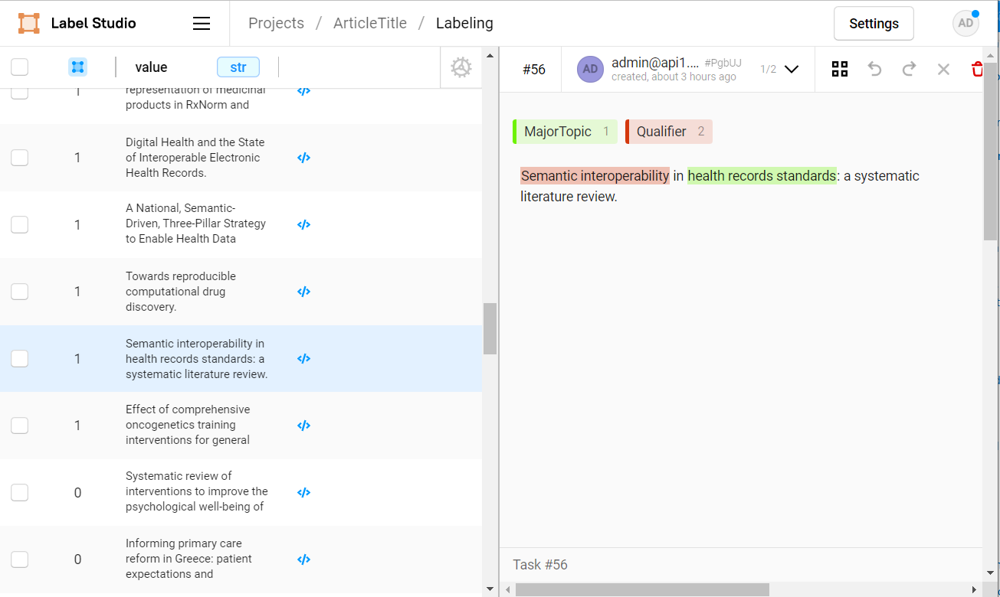

# Trainong NER for Article Title
**Step 1:** Annotate train data with Label Studio




**Step 2:** Export json from Label Studio


**Step 3:** Convert Label Studio Json format to Spacy Training data
```
file = r"C:\...\project-4-at-2023-02-10-10-20-6a18f1dc.json"
data = convert_label_studio_json_to_spacy_train_format(file)
```

**Step 4:** Save Spacy training data to docbin object file format
```
training_data_file = r"C:\...\training_data.spacy"
generate_training_data(data, training_data_file)
```

**Step 5:** configuration file
The recommended way to train your spaCy pipelines is via the spacy train command on the command line. It only needs a single `config.cfg` configuration file that includes all settings and hyperparameters.
use this [link](https://spacy.io/usage/training#quickstart)
```
python -m spacy init fill-config ./base_config.cfg ./config.cfg
```

**Step 6:** Train

```
python -m spacy train config.cfg --output ./ --paths.train ./training_data.spacy --paths.dev ./training_data.spacy
```

**Step 7:** Test Model
```
ner = get_title_ner("Health complaints in individual visiting primary health care: population-based national electronic health records of Iran.")
for e in ner:
    print(f'{e.label_} : {e.ents}')
```

output:
```
QUALIFIER : [Health complaints]
MAJORTOPIC : [individual visiting primary health care]
```
